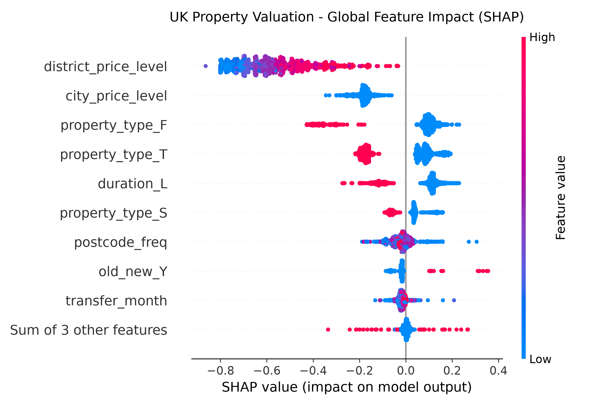
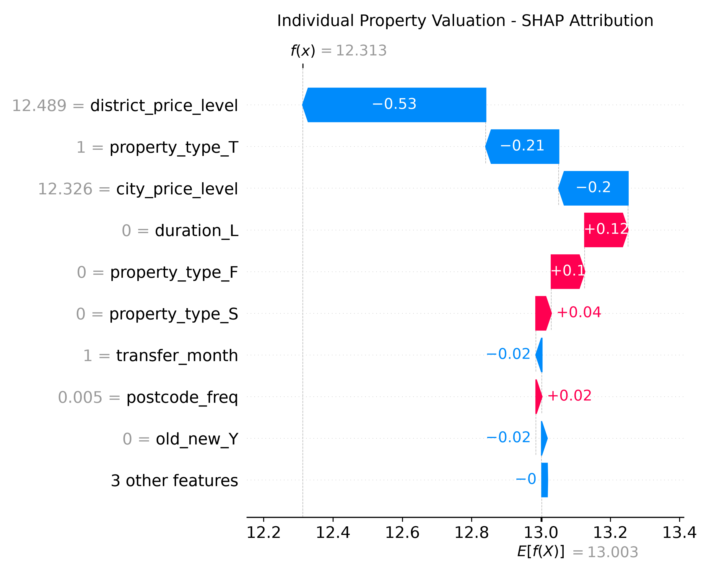

# UK Residential Property Automated Valuation Model (AVM)

[](https://www.python.org/downloads/)
[](https://fastapi.tiangolo.com)
[](https://xgboost.readthedocs.io/)
[](https://opensource.org/licenses/MIT)

An end-to-end Automated Valuation Model (AVM) for UK residential real estate, trained on HM Land Registry price paid transaction data.

The project demonstrates production-grade machine learning: relational database ingestion (MySQL), leak-free spatial feature engineering with Bayesian m-estimate smoothing, native XGBoost model serialization, interpretability reporting via TreeSHAP, and low-latency REST serving via FastAPI.

---

## Architecture Overview

HM Land Registry (Raw CSV)
│
▼
┌─────────────────────────┐
│   MySQL Relational DB   │ ── ETL & Outlier Scrubbing (£50k to £10M)
│  (vw_property_features) │ ── Postcode Outward Code Extraction (e.g. SW11, RG1)
└─────────────────────────┘
│
▼
┌─────────────────────────┐
│   ML Training Pipeline  │ ── Train/Test Split (80/20) prior to feature creation
│   (src/train_model.py)  │ ── Target: Log-Transformed Price ln(1 + p)
│                         │ ── Smoothed Target Encoding (m-estimate, m=10)
└─────────────────────────┘
│
├─────────────────────────────────┐
▼                                 ▼
┌───────────────────────────┐     ┌───────────────────────────┐
│     Native Artifacts      │     │      Model Diagnostics    │
│  - xgb_valuation_model.json│    │  - TreeSHAP Beeswarm Plot │
│  - metadata.json (lookups)│     │  - Local Waterfall Plots  │
└───────────────────────────┘     └───────────────────────────┘
│
┌───────┴────────────────┐
▼                        ▼
┌─────────────────────┐  ┌───────────────────────────────────┐
│ CLI Valuation Tool  │  │ FastAPI REST Microservice         │
│ (src/predict.py)    │  │ (src/api.py -> POST /predict)     │
└─────────────────────┘  └───────────────────────────────────┘


---

## Model Performance & Benchmarks

Baseline comparisons against a naive model (which relied on frequency-only spatial encoding and unconstrained variance):

| Metric | Baseline Model | Upgraded Pipeline | Delta / Improvement |
| :--- | :--- | :--- | :--- |
| **R² Score** | 0.3310 | **0.4521** | **+12.11% explained variance** |
| **Mean Absolute Error (MAE)** | £236,259 | **£213,243** | **-£23,016 average absolute error** |
| **Mean Absolute % Error (MAPE)** | 37.89% | **33.48%** | **-4.41% percentage error** |
| **Root Mean Squared Error (RMSE)**| £612,410 | **£554,276** | **-£58,134 outlier penalty** |

---

## Key Engineering Decisions

### 1. Leak-Free Bayesian Target Encoding
High-cardinality postcodes (thousands of unique outward districts) lead to severe memorization if treated with simple mean encoding. 
* **Leakage Defense:** The training and evaluation sets are split **before** any aggregation happens. Test set samples are strictly out-of-fold.
* **M-Estimate Smoothing:** Postcode district averages are smoothed against the global dataset mean log-price:
  $$\text{Smoothed Value} = \frac{n \times \bar{x}_{\text{district}} + m \times \bar{x}_{\text{global}}}{n + m}$$
  where $m=10$. Low-sample districts shrink safely toward the national prior, while liquid hubs retain their empirical local mean.

### 2. Log-Transformed Price Optimization
UK residential property sales display severe positive skew. Fitting directly to raw currency causes gradient steps to overfit multi-million-pound outliers. Training against $\ln(1 + \text{price})$ normalizes errors and optimizes for relative percentage differences across valuation tiers.

### 3. Decoupled Inference Architecture
During deployment, services must not depend on database queries to calculate spatial statistics. The training pipeline exports `metadata.json` containing the precomputed city baselines, smoothed district weights, and strict column ordering. Downstream endpoints (`predict.py` and `api.py`) evaluate inputs with sub-10ms latency.

---

## Model Interpretability (TreeSHAP)

Global impact analysis reveals that spatial valuation tiers (`city_price_level`, `district_price_level`) combined with structural penalties (`property_type_F` for flats and `duration_L` for leaseholds) drive over 70% of feature gain.

### Global Summary (Beeswarm)


### Single-Instance Valuation Attribution (Waterfall)


---

## Project Structure

```text
uk-property-valuation/
├── data/                          # Raw transaction dumps (git-ignored)
├── models/
│   ├── xgb_valuation_model.json   # Native serialized XGBoost model
│   └── metadata.json              # Precomputed encodings & schema ordering
├── reports/
│   ├── shap_summary_beeswarm.png
│   └── shap_single_property_waterfall.png
├── sql/
│   ├── schema.sql                 # Ingestion schema
│   ├── features_and_indexes.sql
│   └── market_analytics.sql
├── src/
│   ├── api.py                     # FastAPI microservice
│   ├── db_loader.py               # Batch chunk ingestion into MySQL
│   ├── explainability.py          # TreeSHAP report generator
│   ├── predict.py                 # Standalone CLI inference engine
│   └── train_model.py             # Feature pipeline & training execution
├── .env.example                   # Configuration template
├── .gitignore
├── README.md
└── requirements.txt               # Pinned project dependencies